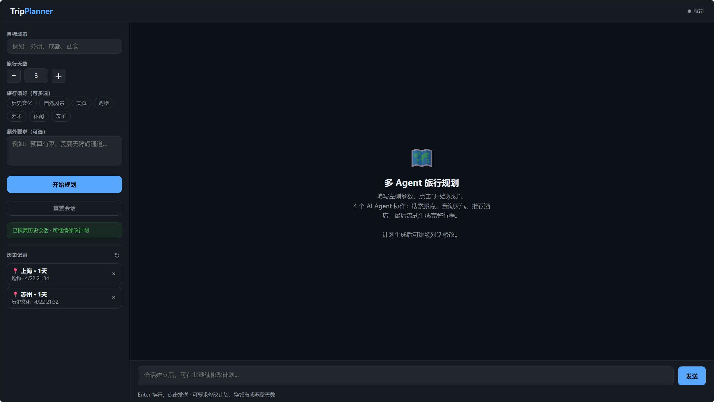
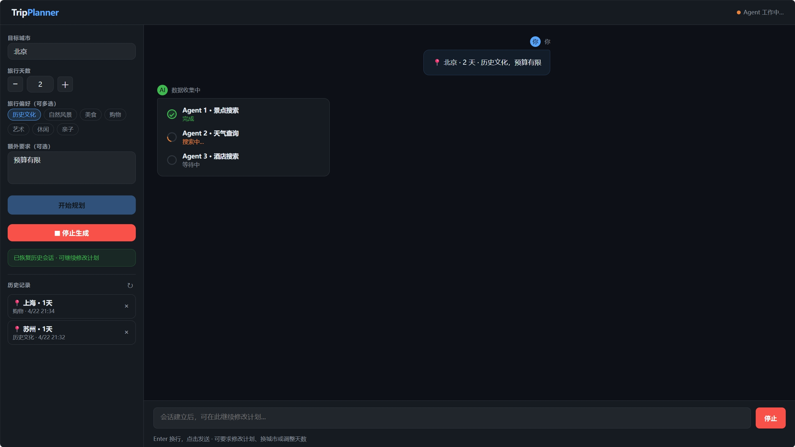
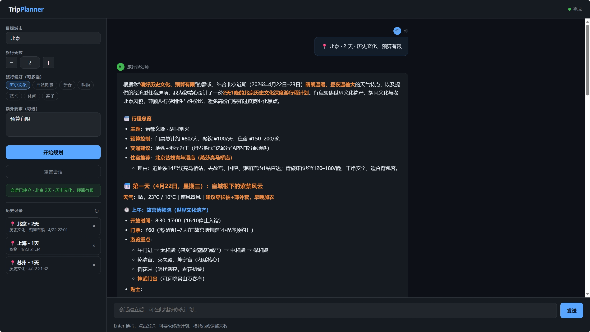
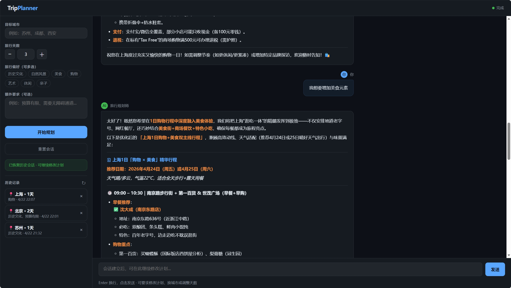
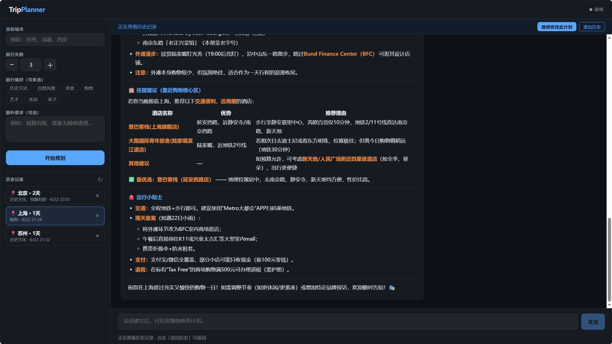
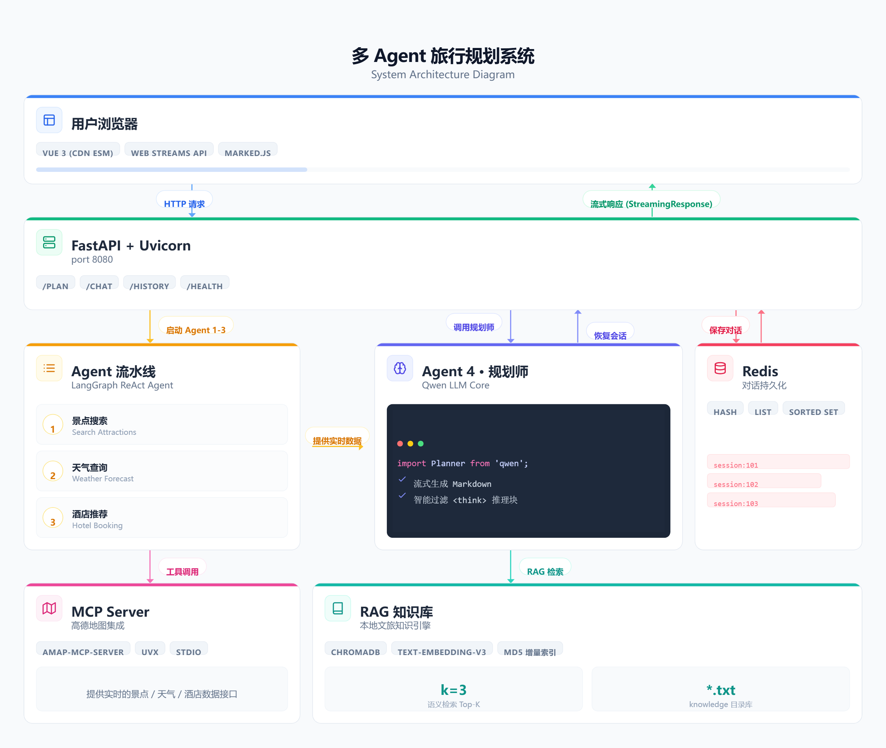

# Trip Planner — 多 Agent AI 旅行规划 Web 应用

基于 **LangChain + LangGraph + MCP + FastAPI** 的多 Agent 协作旅行规划应用。输入目标城市、天数和偏好标签，4 个 AI Agent 自动协作完成景点搜索、天气查询、酒店推荐，并流式生成完整 Markdown 行程计划，支持多轮对话修改与历史对话持久化。

---

## 界面预览


*主界面：左栏配置参数，右栏流式展示行程*


*数据收集阶段：3 个 Agent 的进度动画卡片*


*生成完成阶段：4 个 Agent 全部执行结束后，系统展示完整行程结果，包含每日安排、景点推荐与酒店信息*


*会话建立后可继续追问、换城市、调整天数，AI 自动决策是否重新查询实时数据*


*左栏历史列表：点击查看任意历史对话，或「继续修改此计划」恢复会话*

---

## 架构概览



```
用户请求 POST /plan
   │
   ├── Agent 1 · 景点搜索 ──┐
   ├── Agent 2 · 天气查询 ──┤── MCP（高德地图 amap-mcp-server）
   └── Agent 3 · 酒店推荐 ──┘
          │
          ├── RAG 检索（ChromaDB）── knowledge/ 旅行知识文档
          │
   Agent 4 · 规划师（Qwen LLM）
          │  流式生成 Markdown 行程
          ▼
      浏览器（Web Streams API 打字机效果）
          │
          └── Redis 持久化对话历史
```

---

## 功能特性

- **4 Agent 流水线**：景点搜索 → 天气查询 → 酒店推荐 → 规划师流式生成行程
- **偏好标签**：7 个可多选标签（历史文化、自然风景、美食、购物、艺术、休闲、亲子）+ 自由文本额外要求
- **MCP 工具集成**：通过高德地图 MCP Server（`uvx amap-mcp-server`）获取实时地图、POI、天气数据
- **流式输出**：Web Streams API 打字机效果，过滤 LLM `<think>` 推理块，完成后渲染为 Markdown
- **可中断生成**：流式过程中可随时点击「停止」按钮中断输出
- **多轮对话**：行程生成后可继续追问修改，LLM 自动判断是否需要重新调用 Agent 1-3 获取新数据
- **智能参数感知**：换城市 / 天数 / 偏好时自动触发 Agent 重新查询实时数据
- **RAG 知识库**：本地 `.txt` 旅行知识文档（排队技巧、季节建议、文化禁忌等）自动增量索引，按 MD5 哈希比对只更新变更文件
- **Redis 长期记忆**：对话历史持久化存储，服务重启后可无缝恢复任意历史会话继续修改

---

## 技术栈

| 层 | 技术 |
|---|---|
| 后端框架 | FastAPI + Uvicorn |
| AI 框架 | LangChain + LangGraph（`create_react_agent`） |
| LLM | Qwen（通过阿里云 DashScope，兼容 OpenAI 接口） |
| 工具协议 | MCP（Model Context Protocol）+ `amap-mcp-server` |
| 向量检索 | ChromaDB + `text-embedding-v3`（DashScope） |
| 长期记忆 | Redis（对话元数据 Hash + 消息 List + 时间索引 Sorted Set） |
| 前端 | Vue 3（CDN ESM）+ marked.js，无构建工具 |
| 流式传输 | FastAPI `StreamingResponse` + Web Streams API |

---

## 项目结构

```
my-trip-agent-web/
├── backend/
│   ├── main.py              # FastAPI 入口：路由挂载、静态文件、Redis 连通检查
│   ├── config.py            # LLM 初始化、MCP 配置、MCP stderr 静默补丁
│   ├── schemas.py           # Pydantic 请求模型（PlanRequest / ChatRequest）
│   ├── agents/
│   │   └── react.py         # LangGraph ReAct Agent：run_single_agent / fetch_fresh_data
│   │                        # extract_new_params / stream_planner
│   ├── memory/
│   │   ├── redis.py         # Redis 长期记忆：对话 CRUD + 消息追加
│   │   └── rag.py           # RAG：ChromaDB 增量索引 + 语义检索（retrieve）
│   ├── knowledge/           # 旅行知识文档（.txt），修改后重启自动重新索引
│   │   ├── general.txt      # 通用：购票预约、交通、支付、安全
│   │   ├── beijing.txt
│   │   ├── shanghai.txt
│   │   └── chengdu.txt
│   ├── chroma_db/           # ChromaDB 持久化目录（自动生成）
│   └── routes/
│       └── trip.py          # /plan  /chat  /history  /health 路由
├── frontend/
│   ├── index.html           # Vue 3 单页应用
│   ├── css/style.css        # 全局样式
│   └── js/
│       ├── app.js           # Vue 组件逻辑（表单、消息列表、历史记录、会话管理）
│       ├── api.js           # fetch 封装（planTrip / chatWithAgent / history CRUD）
│       └── stream.js        # 流式解析（consumePlanStream / consumeChatStream，支持中断）
├── docs/
│   └── images/              # README 配图
├── .env                     # 环境变量（需自行配置）
└── run.py                   # 启动入口（port 8080，开发模式热重载）
```

---

## 快速开始

### 前置条件

- Python 3.11+
- Redis（默认 `localhost:6379`）
- `uvx` CLI（用于运行 MCP Server）：`pip install uv`

### 1. 安装依赖

```bash
pip install fastapi uvicorn langchain langchain-openai langchain-mcp-adapters \
            langgraph langchain-chroma chromadb langchain-text-splitters \
            redis python-dotenv
```

### 2. 配置环境变量

在项目根目录创建 `.env`：

```env
# LLM（阿里云 DashScope，兼容 OpenAI 接口）
LLM_MODEL_ID=qwen3-max
LLM_API_KEY=你的 DashScope API Key
LLM_BASE_URL=https://dashscope.aliyuncs.com/compatible-mode/v1

# Embedding（RAG 知识库，DashScope）
EMBED_MODEL_ID=text-embedding-v3

# 高德地图 MCP Server
AMAP_API_KEY=你的高德地图 Web 服务 API Key

# Redis（可选，有默认值）
REDIS_HOST=localhost
REDIS_PORT=6379
REDIS_PASSWORD=
REDIS_DB=0
```

获取方式：
- **LLM_API_KEY**：[阿里云百炼控制台](https://bailian.console.aliyun.com/)
- **AMAP_API_KEY**：[高德开放平台](https://lbs.amap.com/)，需开通 **Web 服务** 权限

### 3. 启动服务

```bash
python run.py
```

浏览器访问 **http://localhost:8080**

---

## API 说明

### `POST /plan` — 生成旅行计划（流式）

4 个 Agent 协作执行，响应为纯文本流。**末尾最后一行**固定为 `[SESSION_ID:xxx]`，前端解析后用于后续多轮对话。

**请求体：**
```json
{
  "city": "成都",
  "days": 3,
  "preferences": "美食、历史文化，预算有限"
}
```

---

### `POST /chat` — 多轮对话修改计划（流式）

基于 `/plan` 返回的 `session_id` 继续对话。后端自动判断是否需要重新调用 Agent 1-3。

**请求体：**
```json
{
  "session_id": "由 /plan 返回的会话 ID",
  "message": "把第二天改成自然风景主题，换成九寨沟"
}
```

---

### `GET /history` — 历史对话列表

返回所有已持久化的对话，按更新时间倒序。

```json
[
  {
    "session_id": "uuid",
    "city": "成都",
    "days": 3,
    "preferences": "美食",
    "created_at": "2025-06-01 10:00:00",
    "updated_at": "2025-06-01 10:08:00"
  }
]
```

### `GET /history/{session_id}` — 指定对话的消息列表

返回该会话的完整消息历史（用户 + AI 交替），可用于恢复上下文继续修改。

### `DELETE /history/{session_id}` — 删除历史对话

### `GET /health` — 健康检查

```json
{ "status": "ok", "active_sessions": 2 }
```

---

## RAG 知识库

`backend/knowledge/` 目录存放旅行知识 `.txt` 文档。服务启动时自动增量索引：

- 新增或内容变更的文件 → 删除旧 chunks，重新切块（400字符 / 重叠50）写入 ChromaDB
- 未变更文件（MD5 哈希一致）→ 直接跳过，启动速度不受文档数量影响

生成行程时自动语义检索最相关的 3 个片段，补充实用建议（排队技巧、预约攻略、季节注意事项等）。

**添加新城市**：在 `knowledge/` 目录放入 `城市名.txt`，重启服务即可自动索引。

---

## 会话生命周期

```
POST /plan
  └─► 生成行程 + 建立 session_id
        │
        ├── 进程内缓存（runtime state：MCP client、消息历史）
        └── Redis 持久化（city / days / preferences + 完整消息列表）

POST /chat（同一 session_id）
  └─► 进程内有缓存 → 直接复用
      进程内无缓存（服务重启后）→ 从 Redis 重建上下文，无缝继续

前端「继续修改此计划」
  └─► 加载 Redis 历史消息渲染到界面，启用对话输入框
```